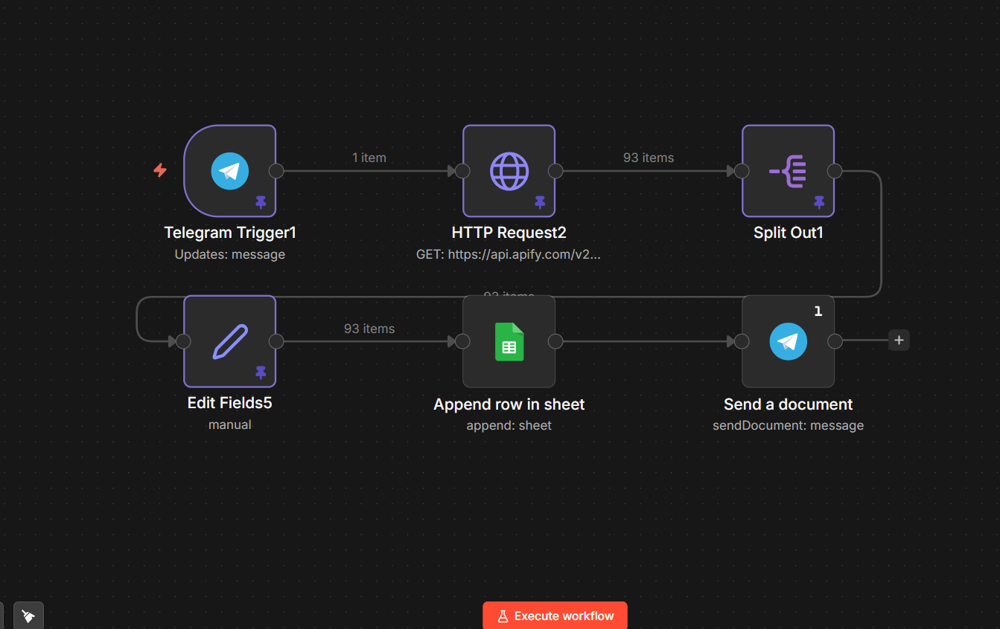
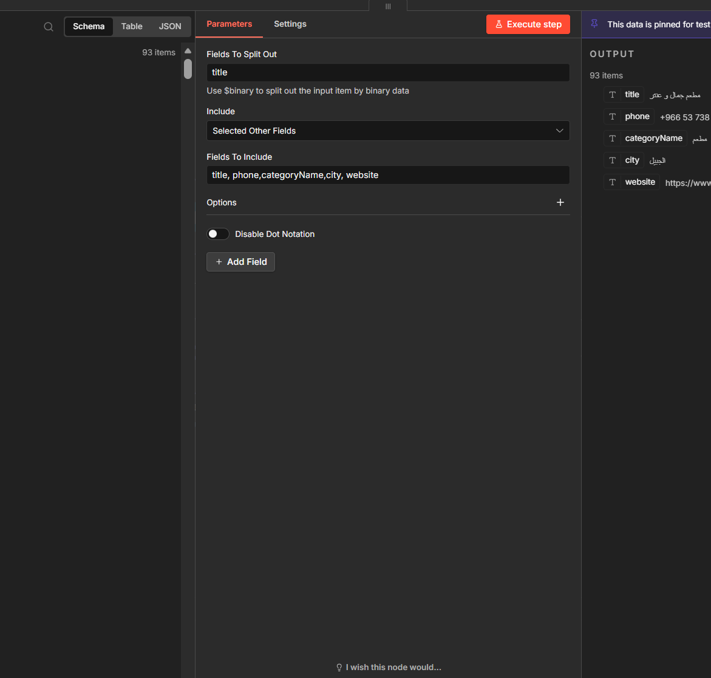
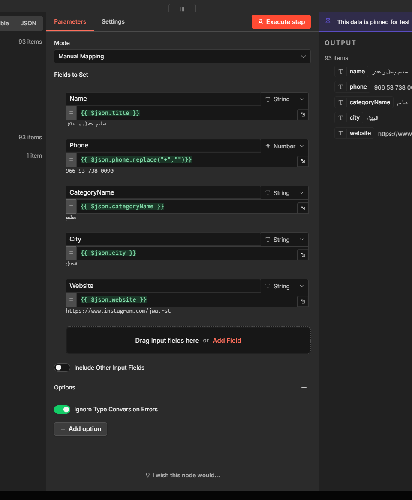

# 🤖 Automation Workflow Data Collection by n8n

An automated AI-powered workflow built using **n8n** to collect, clean, and structure data from Google Maps using the **Apify API**.

The workflow runs automatically and stores processed data in **Google Sheets**, then sends the final results directly through **Telegram**.

---

## 🚀 Overview

This workflow automates the entire data collection process:

- Fetch business data from Google Maps through Apify
- Process and clean the collected information
- Structure data into a standardized format
- Store results in Google Sheets
- Deliver reports via Telegram

---

## 📸 Workflow Preview

### Main Workflow



---

## ✨ Key Features

- 🤖 AI-based classification & enrichment
- 🔄 Error handling and retry logic
- ⏰ Automatic execution
- 📊 Clean JSON → Google Sheets mapping
- 📩 Telegram integration
- 🌍 Google Maps data extraction via Apify

---

## 🧠 Workflow Logic

```text
Telegram Trigger
       ↓
HTTP Request (Apify API)
       ↓
Data Cleaning & Processing
       ↓
Google Sheets Storage
       ↓
Telegram Document Delivery
```

---

## 📸 Workflow Steps

### 1️⃣ Telegram Trigger

Receives user input and starts the workflow.

### 2️⃣ Apify API Request

Collects Google Maps business data using Apify.

### 3️⃣ Data Processing

Cleans and formats the collected data.




### 4️⃣ Google Sheets Integration

Stores processed records into Google Sheets.


### 5️⃣ Telegram Delivery

Sends the final report or document back to Telegram

---

## 🛠 Tech Stack

- n8n
- Apify API
- Google Sheets API
- Telegram Bot API
- HTTP Requests
- JSON Processing

---

## 📂 Project Structure

```text
.
├── assets/
├── workflow.json
└── README.md
```

---

## ⚙️ Setup

1. Import `workflow.json` into n8n
2. Configure Apify credentials
3. Configure Google Sheets credentials
4. Configure Telegram Bot credentials
5. Activate the workflow

---

## 👤 Author

**Omar Sahhari**

Data • AI • Automation Systems
